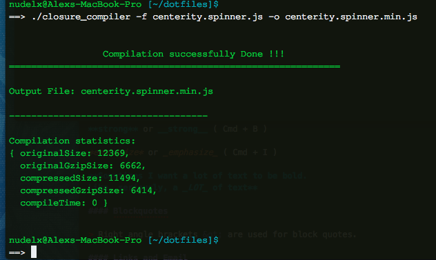
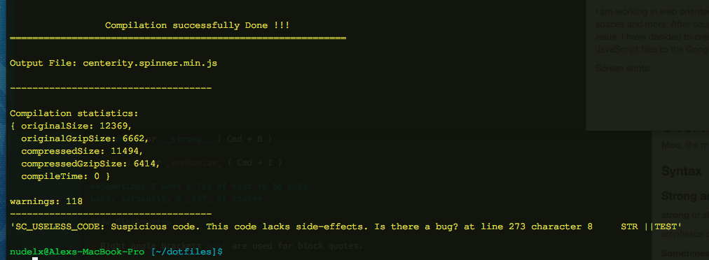
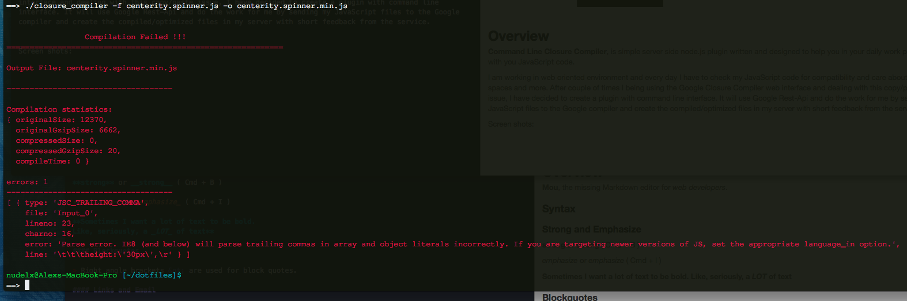

<br>
#  Google Closure Compiler Command Line Service 
#### Very simple and very useful command line service to optimize and compile your JavaScript code.
****  

</br>

 
</br>
</br>


## Overview 
**Command Line Closure Compiler**, is a simple server side node.js plugin written and designed to help you in daily work process with your JavaScript code.  

I am working in web oriented environment and every day I have to check my JavaScript code for compatibility and care about the white spaces and more. After couple of times I being using the Google Closure Compiler web interface, dealing with this copy/paste issue. I have decided to create a plugin with command line interface. The Plugin can use Google Rest-Api and do the work for me by sending my JavaScript files to the Google compiler and create the compiled/optimized file in my server with short feedback from the service.  

<br>
<br>

###What is the Closure Compiler?

The Closure Compiler is a tool for making JavaScript download and run faster. It is a true compiler for JavaScript. Instead of compiling from a source language to machine code, it compiles from JavaScript to better JavaScript. It parses your JavaScript, analyzes it, removes dead code and rewrites and minimizes what's left. It also checks syntax, variable references, and types, and warns about common JavaScript pitfalls.  

<br>
### What are the benefits of using Closure Compiler?

**Efficiency**. The Closure Compiler reduces the size of your JavaScript files and makes them more efficient, helping your application to load faster and reducing your bandwidth needs.

**Code checking**. The Closure Compiler provides warnings for illegal JavaScript and warnings for potentially dangerous operations, helping you to produce JavaScript that is less buggy and easier to maintain.  
<br>
More information about [Google Closure Compiler](https://developers.google.com/closure/compiler/docs/gettingstarted_ui). 


<br>
<br>

### Requirments   

* node-js
* internet connection

<br>
<br>

### Help & Usage

```
Welcome to Simple JavaScript Compiler
Based on google closure compiler
Author: Alex Nudelman
Version: v.1.0  2014
===========================================================================

This script will check your javascript syntax for warnings and errors,
optimize it and compress it.

What are the benefits of using Closure Compiler?

Efficiency - The Closure Compiler reduces the size of your JavaScript files
and makes them more efficient, helping your application to load faster and reducing your bandwidth needs.

Code checking - The Closure Compiler provides warnings for illegal JavaScript and warnings for potentially dangerous operations,
helping you to produce JavaScript that is less buggy and easier to maintain.
for more info visit http://closure-compiler.appspot.com


Usage:

./closure_compiler -f my-javascrit-file.js  -o my.min.compied.file.js

-f | file name to compile
-o | output file name ( optional )

```


<br>
<br>
 
### Succeeded compilation 
***
 

</br>
</br>
### Warning 
***
 
 
</br>
</br>
### Error 
***
 

Use it and enjoy  

I will happy to have your feedback.
