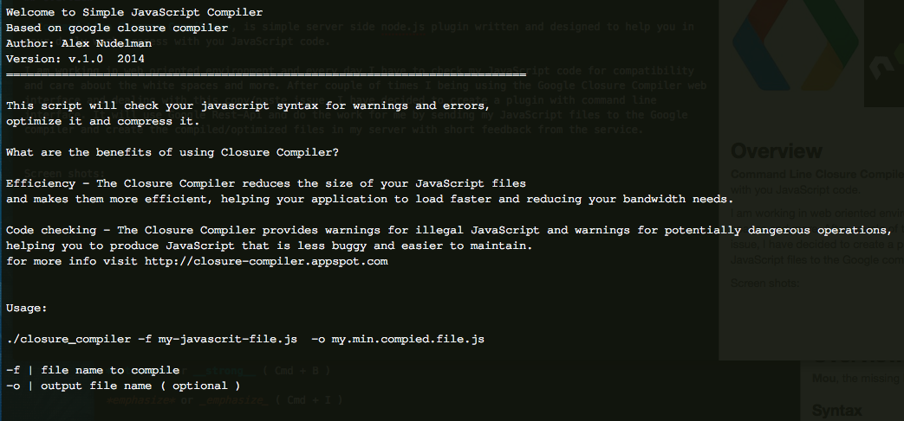

#  Google Closure Compiler - Command Line Service 
#### Very simple and very useful command line service to optimize and compile your JavaScript code.
****
 

 
 
## Overview 

**Command Line Closure Compiler**, is simple server side node.js plugin written and designed to help you in your daily work process with you JavaScript code.  

I am working in web oriented environment and every day I have to check my JavaScript code for compatibility and care about the white spaces and more. After couple of times I being using the Google Closure Compiler web interface and dealing with this copy/paste issue, I have decided to create a plugin with command line interface. It will use Google Rest-Api and do the work for me by sending my JavaScript files to the Google compiler and create the compiled/optimized files in my server with short feedback from the service. 

 
 
##### Help
***
 
 
 
  
### Succeeded compilation 
***
 

 
 
### Warning 
***
 
 
 
 
### Error 
***
 

Use it and enjoy  

I will happy to have your feedback.
